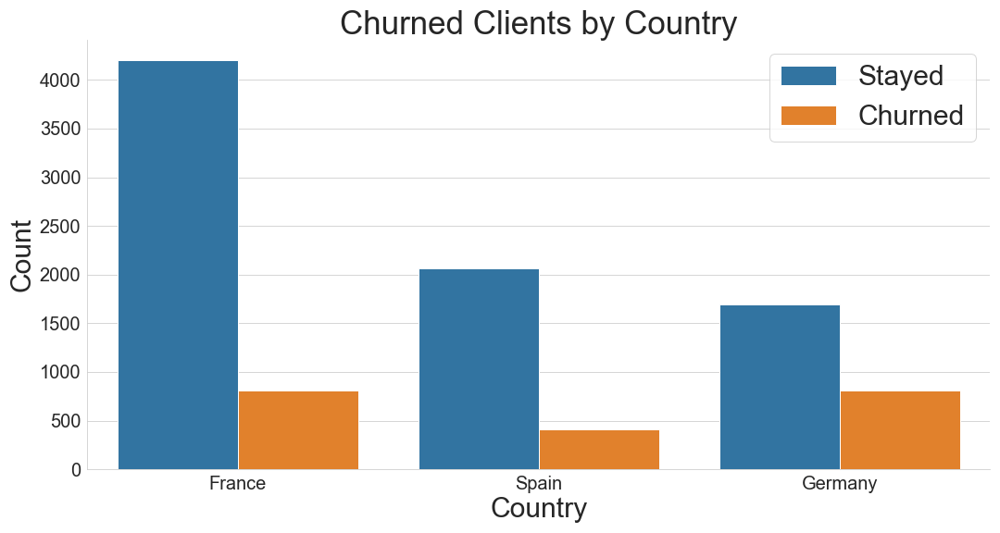
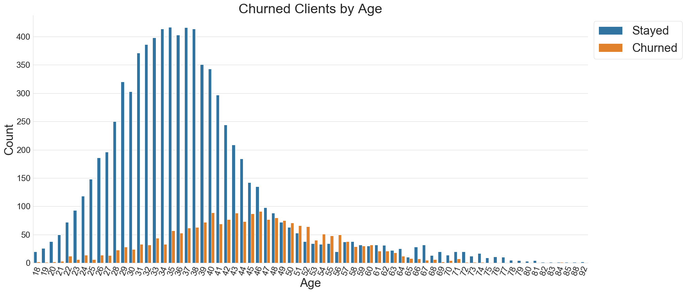
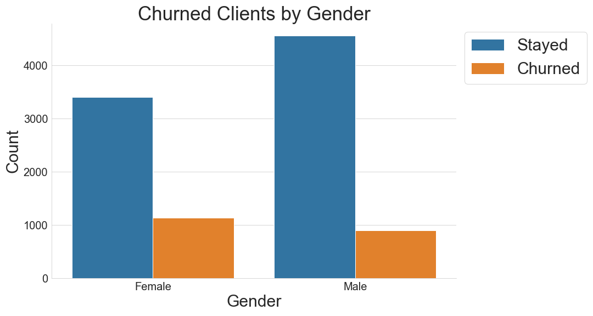
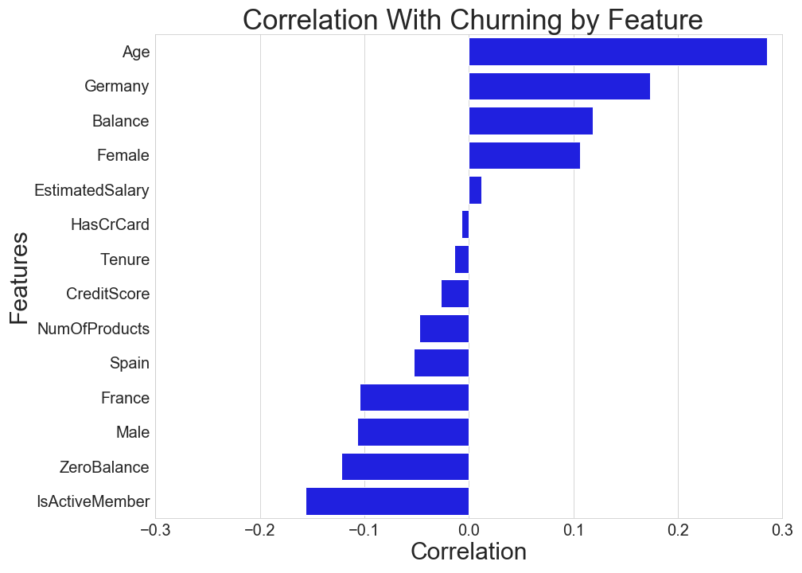
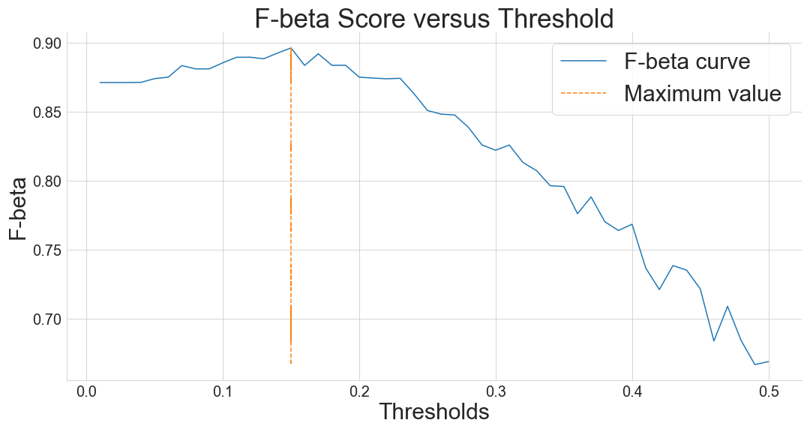

# Client Churn Predictor

Here is a video demonstration of the Streamlit app for this project: [Streamlit video](https://www.youtube.com/watch?v=EgYYRRCrR-E)

The goal of this project was to correctly identify clients who were likely to churn (i.e. close their accounts) at a bank. The client data was downloaded from kaggle
[here](https://www.kaggle.com/santoshd3/bank-customers).

**Please view the [powerpoint slides PDF file](https://github.com/peterjprudhomme/Client-Churn-Predictor/blob/main/PowerPointSlides.pdf) for an in-depth overview of this project**

## How it works

The notebook file contains all the EDA and the model creation. Random Forest was determined to generate the most accurate results based on the f-score with an adjusted threshold to favor model recall. The data was upsampled to  balance the target variable of 'Exited'.

The file **streamlit_app.py** a streamlit app to facilitate easy upload and modeling on new data. 

## Results

Final model recall of 92% and precision of 30%. Please see the powerpoint presentation in this repo for a full analysis of this project.

## Exploratory Data Analysis Graphics

 
 
 
 

 
 
 
 

 
 
 
 

 
 
 
 

